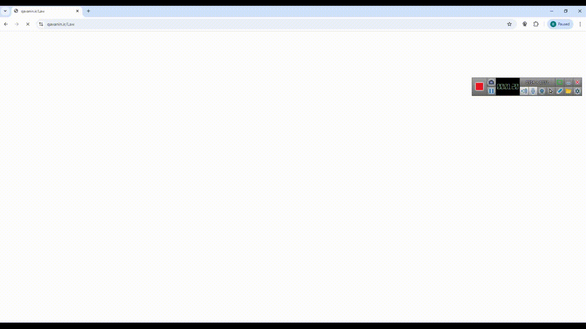

# FArvan CDN

This repository includes a Chrome extension and a web API for bypassing the protection mechanism of ArvanCloud, which is configured on government websites.

**Before**


**After**



## Problem Statement

These government websites, typically serving as information portals, are designed to provide services and information to users without considering their identity. However, with this protection mechanism in place, users who frequently visit these portals face significant delays. Even the stored cookies have a short expiration time.


Therefore, we decided to use a web API and a Chrome extension to automatically bypass this protection mechanism, allowing users to connect to government information portals more quickly.

## Chrome Extension

The extension is located in `chrome_extension` folder. You can install it manually in chrome step by step:

- **Open Chrome** and go to the **Extensions page** by entering this URL in your browser’s address bar:

    ```bash
    chrome://extensions/
    ```

- **Enable Developer Mode**:
    - In the top-right corner of the Extensions page, you’ll see a toggle switch labeled "Developer mode". Turn it on.
- **Load Unpacked Extension**:
    - Click the button that says **"Load unpacked"**.
    - In the file browser window that opens, navigate to the folder where your extension files are located (the folder containing `manifest.json`, `content.js`, and `background.js`).
    - Select the folder and click "Select Folder" (or "Open").
- **Verify Installation**:
    - Once loaded, you should see your extension appear on the list with its name, description, and version.
    - If you don't see any errors, the extension is successfully installed!
